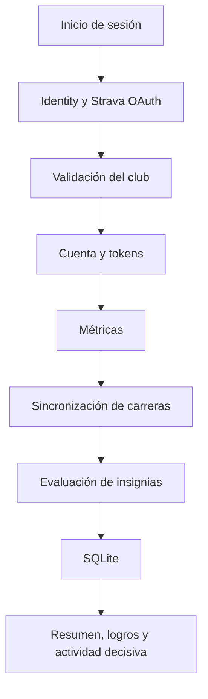
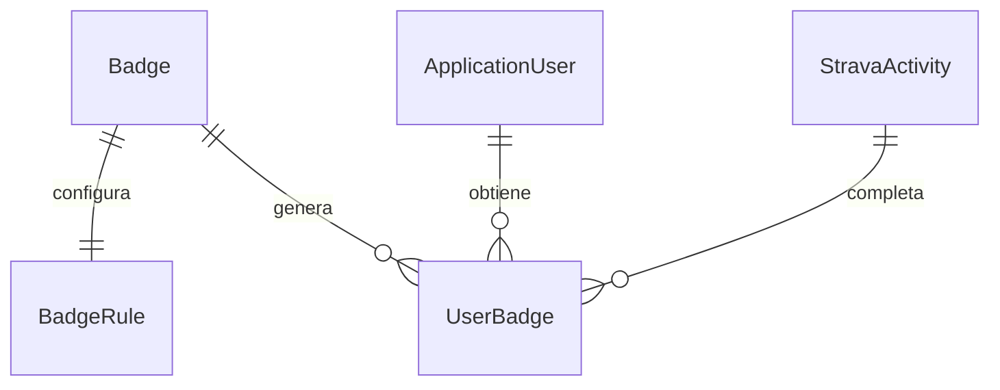

# Arquitectura

## Objetivo

StravaTeamApp centraliza la autenticación del equipo, la sincronización de
carreras, el seguimiento mensual y la asignación de insignias configurables.
La aplicación utiliza Razor Pages y una arquitectura sencilla orientada a
servicios, con Entity Framework Core como capa de persistencia.

## Tecnologías

- ASP.NET Core Razor Pages sobre .NET 10.
- ASP.NET Core Identity para usuarios, roles, contraseñas, logins externos y
  tokens.
- Entity Framework Core 10.
- SQLite para el entorno actual.
- OAuth de Strava mediante `AspNet.Security.OAuth.Strava`.
- Bootstrap para la interfaz.

## Componentes

| Componente | Responsabilidad |
| --- | --- |
| `Areas/Identity` | Inicio de sesión local, OAuth de Strava, registro y vinculación de cuentas. |
| `Pages/Admin` | Panel administrativo, usuarios e insignias. |
| `Pages/Running` | Sincronización, métricas mensuales, carreras e insignias obtenidas. |
| `Pages/Sistema` | Perfil y registros internos. |
| `Services/StravaService.cs` | API de Strava, validación del club y renovación de tokens. |
| `Services/BadgeEvaluationService.cs` | Evaluación genérica y otorgamiento idempotente de insignias. |
| `Data/AppDbContext.cs` | Entidades, relaciones, restricciones e índices. |
| `Data/Seed/IdentitySeeder.cs` | Creación de roles y administrador inicial. |
| `Models/Badges` | Configuración, reglas y otorgamientos de insignias. |
| `Migrations` | Evolución versionada del esquema de datos. |

## Flujo de ejecución

## Autenticación y autorización

Identity permite que una sola cuenta tenga simultáneamente:

- Login local con contraseña, utilizado por administradores.
- Login externo de Strava.
- Rol `Member`.
- Rol `Administrator`.

Las páginas administrativas usan actualmente
`[Authorize(Roles = "Administrator")]`. Las páginas de perfil y métricas
requieren un usuario autenticado.

## Integración con Strava

`StravaService` concentra toda la integración:

- Valida la membresía mediante `athlete/clubs`.
- Consulta hasta 50 actividades recientes mediante `athlete/activities`.
- Conserva únicamente actividades de tipo `Run`.
- Convierte la respuesta de Strava al modelo local.
- Renueva el access token si le quedan menos de cinco minutos.
- Guarda el access token, refresh token, fecha de expiración y tipo de token
  mediante ASP.NET Core Identity.

La pantalla de Métricas realiza un upsert por el identificador de Strava:
actualiza actividades existentes y agrega las nuevas.

## Motor de insignias

Después de sincronizar las actividades del usuario,
`BadgeEvaluationService`:

1. Carga las insignias activas con su regla.
2. Carga las carreras del usuario en orden cronológico.
3. Agrupa las carreras por semana, mes o periodo personalizado.
4. Aplica la operación configurada.
5. Identifica la primera actividad que alcanza la meta.
6. Crea un `UserBadge` con el valor y la actividad decisiva.
7. Evita duplicados por usuario, insignia y periodo.

La especificación completa se encuentra en
[Sistema de insignias](badges.md).

## Persistencia

`AppDbContext` hereda de `IdentityDbContext<ApplicationUser>` e integra:

- Tablas de ASP.NET Core Identity.
- `Activities`.
- `SystemLogs`.
- `Badges`.
- `BadgeRules`.
- `UserBadges`.

Relaciones principales:

Reglas de integridad relevantes:

- Una insignia tiene exactamente una regla.
- `TargetValue` debe ser mayor que cero.
- Los otorgamientos conservan referencias a usuario, insignia y actividad.
- No puede existir más de un otorgamiento de la misma insignia para el mismo
  usuario y periodo.
- Una insignia con historial no se elimina en cascada.

## Registros

Los errores de renovación, sincronización y evaluación se escriben en
`SystemLogs`. El panel administrativo presenta los 100 registros más
recientes.

## Limitaciones actuales

- La sincronización ocurre cuando el usuario abre Métricas; no existe un
  proceso en segundo plano.
- La consulta actual de Strava obtiene un máximo de 50 actividades por
  solicitud.
- SQLite es la base de datos del entorno actual.
- La autorización todavía utiliza nombres de rol directamente y no policies.
- No existe todavía una suite automatizada de pruebas.
