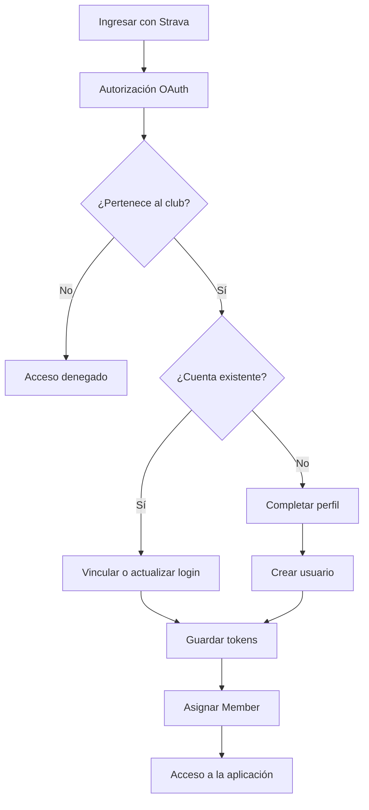

# Autenticación y autorización

## Tipos de acceso

La aplicación admite dos formas de inicio de sesión sobre la misma entidad
`ApplicationUser`.

| Acceso | Uso principal | Validación |
| --- | --- | --- |
| Strava OAuth | Corredores y vinculación de la cuenta | Membresía en el club oficial |
| Correo y contraseña | Administración | Rol `Administrator` |

Una cuenta administrativa puede vincular Strava sin crear un usuario
duplicado.

## Roles

`IdentitySeeder` garantiza la existencia de:

- `Member`
- `Administrator`

El rol `Member` se asigna al completar correctamente el acceso con Strava.
El rol `Administrator` se asigna al administrador inicial y puede gestionarse
desde el panel administrativo.

Una cuenta puede tener ambos roles al mismo tiempo.

## Flujo de Strava



La validación del club se realiza antes de permitir el acceso. El
identificador del club oficial está actualmente definido en el callback de
Strava.

## Vinculación de cuentas

El callback contempla tres casos:

1. Si el usuario ya inició sesión, Strava se vincula a esa cuenta.
2. Si el login de Strava ya existe, se inicia sesión con la cuenta asociada.
3. Si no existe una cuenta, se solicita correo, nombre, apellido, género y
   UPIN antes de crearla.

No se permite vincular la misma cuenta de Strava con dos usuarios diferentes.
Si el correo ya está registrado, el usuario debe iniciar sesión primero y
vincular Strava desde su cuenta existente.

## Tokens

Los tokens se guardan mediante ASP.NET Core Identity con proveedor `Strava`:

- `access_token`
- `refresh_token`
- `expires_at`
- `token_type`

`StravaService.GetValidAccessTokenAsync` reutiliza el access token cuando
tiene más de cinco minutos de vigencia. En caso contrario, utiliza el refresh
token y guarda inmediatamente los valores nuevos.

## Administrador inicial

El seed lee las siguientes claves:

```text
InitialAdmin:Email
InitialAdmin:Password
InitialAdmin:UPIN
```

Si las tres están configuradas:

- Crea el usuario cuando no existe.
- Agrega una contraseña cuando la cuenta existente aún no tiene una.
- Conserva una cuenta creada anteriormente.
- Asigna el rol `Administrator`.

El administrador puede iniciar sesión localmente y luego vincular Strava para
obtener también el rol `Member`.

## Protección de páginas

| Área | Requisito actual |
| --- | --- |
| Métricas y perfil | Usuario autenticado |
| Panel de administración | `Administrator` |
| Gestión de insignias | `Administrator` |
| Registros del sistema | `Administrator` |

La migración de autorización basada en roles a policies permanece en el
roadmap.
